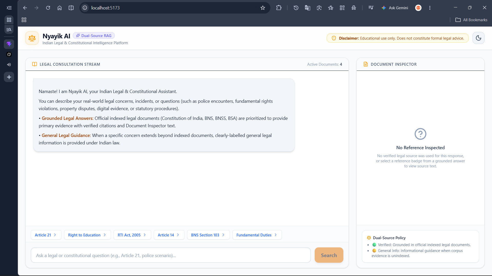
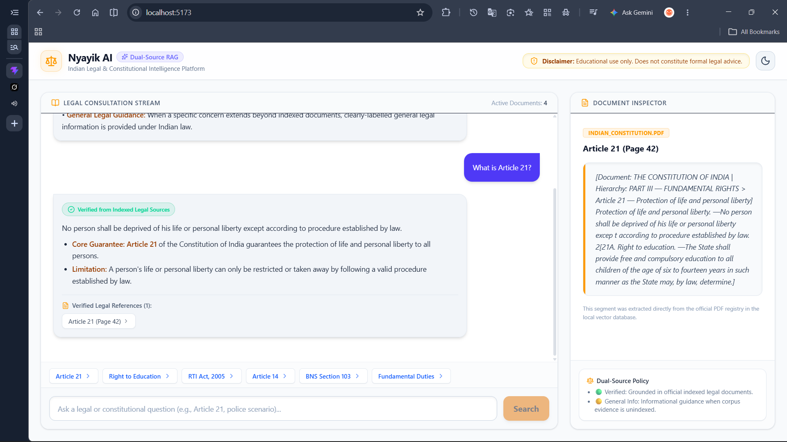
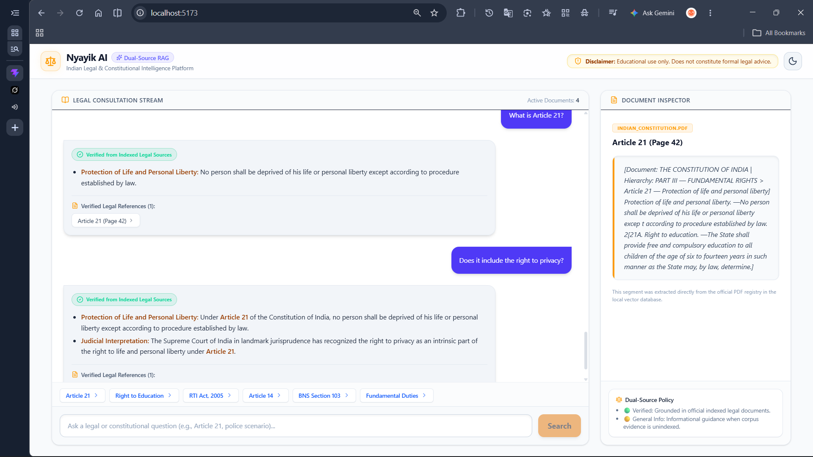
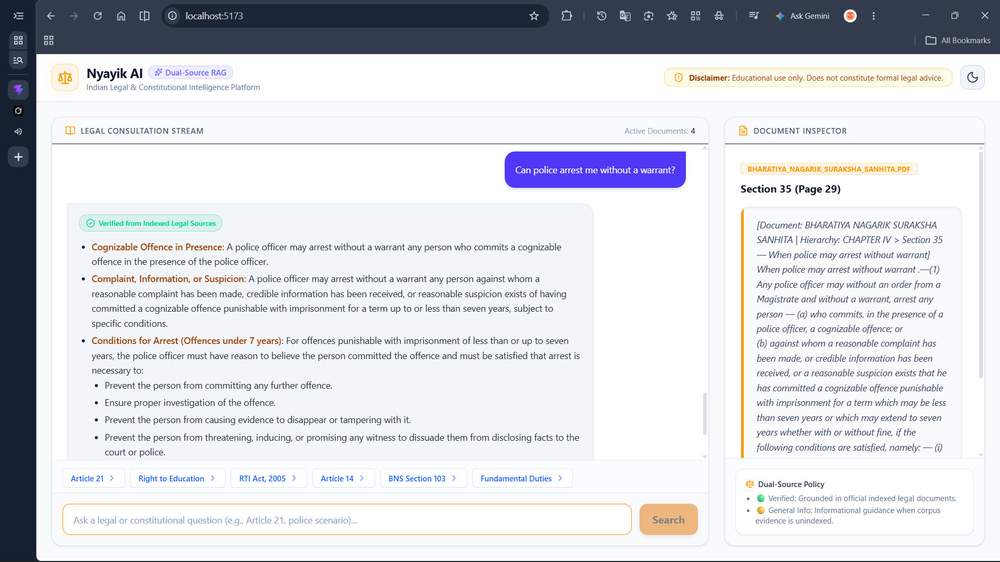
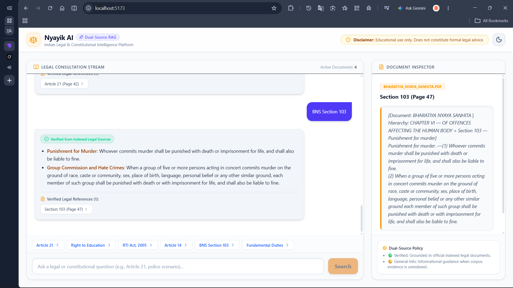
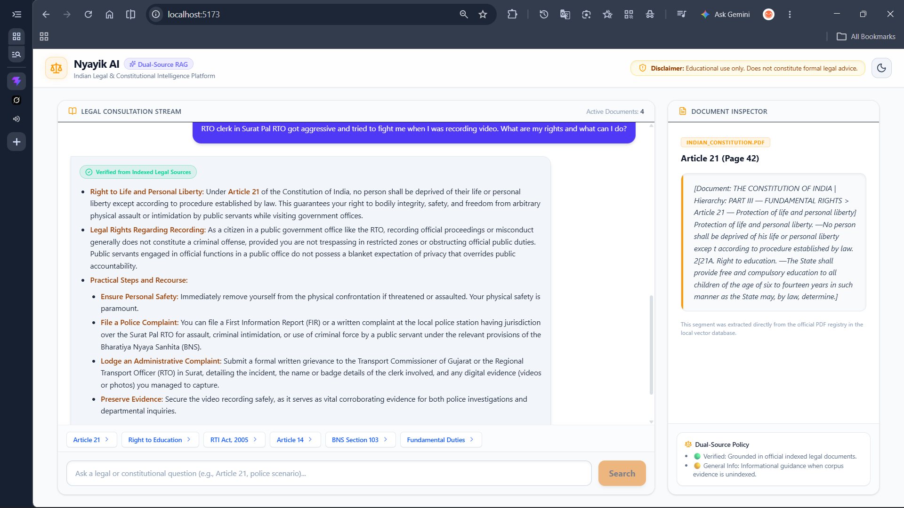

# Nyayik AI

**Indian Legal & Constitutional Intelligence Platform**

[](https://www.python.org/)
[](#)
[](#)
[]([YOUR_LINKEDIN_URL](https://www.linkedin.com/in/satyam-a-yadav/))


> Ask legal questions in plain language.  
> Get answers grounded in Indian legal sources.

---

### Demo

[](assets/Video%20Project.mp4)

**Try these queries:**

| Query | What it demonstrates |
|-------|----------------------|
| What is Article 21? | Core constitutional retrieval |
| Does it include the right to privacy? | Multi-turn + contextual follow-up |
| Can police arrest me without a warrant? | Practical citizen rights |
| BNS Section 103 | Statutory provision lookup |
| RTO clerk in Surat Pal RTO got aggressive... | Real-world messy query |

---

### Screenshots

<table>
  <tr>
    <td align="center"><br/><b>Home</b></td>
    <td align="center"><br/><b>Article 21</b></td>
  </tr>
  <tr>
    <td align="center"><br/><b>Right to Privacy follow-up</b></td>
    <td align="center"><br/><b>Police arrest without warrant</b></td>
  </tr>
  <tr>
    <td align="center"><br/><b>BNS Section 103</b></td>
    <td align="center"><br/><b>Real-world RTO incident</b></td>
  </tr>
</table>

---

### The Core Insight

Most legal RAG systems treat documents as plain text.  
Legal documents (especially the Constitution) have **structure**.

A simple query like *“What is Article 21?”* can easily return:
- Incomplete text
- Neighbouring provisions (Article 21A)
- Index / annexure noise

**Retrieving similar text is not enough.**  
You need the *correct provision* and its operative language.

Nyayik therefore uses:
- Structural metadata propagation
- Stricter provision boundary detection
- Metadata-aware retrieval

---

### Key Features

- Dual-Source RAG architecture
- Structure-aware legal document processing
- Clean source citations
- Practical, citizen-friendly answers
- Strong grounding (refuses to hallucinate when evidence is limited)
- Support for constitutional + statutory queries

---

### Performance (Sample Queries)

Measured on real queries against the live system0.

| Query                              | Total Latency | Retrieval | Generation | Top Similarity |
|------------------------------------|---------------|-----------|------------|----------------|
| What is Article 21?                | 2.9 s         | 1.7 s     | 1.2 s      | 0.95           |
| Does Article 21 include privacy?   | 2.8 s         | 1.5 s     | 1.2 s      | 0.95           |
| BNS Section 103                    | 3.4 s         | 1.6 s     | 1.7 s      | 0.95           |
| Can police arrest without warrant? | 3.8 s         | 1.3 s     | 2.4 s      | 0.80           |
| Surat Pal RTO real-world scenario  | 4.8 s         | 1.8 s     | 2.8 s      | 0.95           |

**Notes**
- All responses were fully grounded in indexed legal sources
- Correct source document was automatically selected in every case
- Retrieval threshold: 0.65
- No fallback or hallucination triggered on these queries

---

### Tech Stack

| Layer                 | Choice                          |
|-----------------------|---------------------------------|
| Frontend | React (Vite SPA), Tailwind CSS, Lucide React Icons |
| Backend | Python 3.12, FastAPI, Uvicorn (with --warmup pre-loading) |
| Orchestration | LangGraph (Deterministic State Machine Routing) |
| Vector Store | Qdrant Cloud (Cosine Distance, Hybrid metadata filtering) / FAISS (Local Fallback) |
| Embeddings | HuggingFace BAAI/bge-small-en-v1.5 (384-dimensional dense vectors) |
| LLM Engine | Google Gemini 2.5 Flash / OpenAI / Local Ollama (llama3) fallback |
| Testing & Metrics | Pytest, RAGAS Framework, Custom JSONL Performance Logging |

---

### High-Level Architecture

```text
┌───────────────────────────────┐
│ User Query + Session History  │
└───────────────┬───────────────┘
                │
                ▼
┌───────────────────────────────┐
│ FastAPI Server                │
│ /api/query                    │
└───────────────┬───────────────┘
                │
                ▼
┌───────────────────────────────┐
│ LangGraph Intent Classifier   │
│ Node                          │
└───────────────┬───────────────┘
                │
       ┌────────┼───────────────┐
       │        │               │
       ▼        ▼               ▼
 Conversational  Out of Domain  Legal Query
       │        │               │
       ▼        ▼               ▼
┌────────────┐ ┌──────────────┐ ┌──────────────────────────────┐
│ Fastpath / │ │ Polite       │ │ Document Filter Detector &   │
│ Conversat. │ │ Out-of-       │ │ Query Normalizer            │
│ Node       │ │ Domain Node  │ └──────────────┬───────────────┘
└────────────┘ └──────────────┘                │
                                               ▼
                              ┌───────────────────────────────┐
                              │ Qdrant Cloud / FAISS          │
                              │ Vector Search                 │
                              └──────────────┬────────────────┘
                                             │
                                             ▼
                              ┌───────────────────────────────┐
                              │ Ambiguous Across Acts?        │
                              └──────────────┬────────────────┘
                                     ┌───────┴───────┐
                                    Yes              No
                                     │                │
                                     ▼                ▼
                          ┌──────────────────┐  ┌──────────────────────┐
                          │ Clarification    │  │ Top Similarity       │
                          │ Request Node     │  │ >= 0.65?             │
                          └──────────────────┘  └──────────┬───────────┘
                                                           │
                                                   ┌───────┴───────┐
                                                  Yes              No
                                                   │                │
                                                   ▼                ▼
                              ┌──────────────────────────┐  ┌──────────────────────────┐
                              │ Mode A                   │  │ Mode B                   │
                              │ Grounded Answer Node     │  │ General Legal Guidance   │
                              │                          │  │ Node                     │
                              │ Strict PDF Evidence      │  │ Broader Knowledge +      │
                              │ + Citations              │  │ Disclaimer Banner        │
                              └────────────┬─────────────┘  └────────────┬─────────────┘
                                           │                             │
                                           └──────────────┬──────────────┘
                                                          │
                                                          ▼
                                      ┌──────────────────────────────────┐
                                      │ Response Formatting &            │
                                      │ Citation Sanitization            │
                                      └────────────────┬─────────────────┘
                                                       │
                                                       ▼
                                      ┌──────────────────────────────────┐
                                      │ React Dashboard +                │
                                      │ Document Inspector Panel         │
                                      └──────────────────────────────────┘

```

---

### Project Structure
```
ai_legal_intelligence_platform/
├── Backend/
│   ├── app/
│   │   ├── api/
│   │   │   ├── __init__.py
│   │   │   └── endpoints.py
│   │   ├── core/
│   │   │   └── metrics.py
│   │   ├── scripts/
│   │   │   ├── ingest.py
│   │   │   ├── inspect_chunks.py
│   │   │   └── run_server.py
│   │   ├── utils/
│   │   │   ├── document_processor.py
│   │   │   ├── lifecycle.py
│   │   │   └── models.py
│   │   ├── __init__.py
│   │   ├── config.py
│   │   └── main.py
│   ├── logs/
│   │   └── performance.jsonl
│   └── requirements.txt
├── Data/
│   ├── raw/
│   └── processed/
├── Evaluation/
│   ├── __init__.py
│   ├── analyze_metrics.py
│   ├── benchmark_threshold.py
│   └── run_eval.py
├── Frontend/
│   ├── src/
│   │   ├── App.css
│   │   ├── App.jsx
│   │   ├── main.jsx
│   │   └── index.css
│   ├── index.html
│   ├── vite.config.js
│   └── package.json
├── Graph/
│   ├── __init__.py
│   └── workflow.py
├── Prompts/
│   └── prompt_templates.py
├── Vectorstore/
│   ├── __init__.py
│   ├── faiss_store.py
│   ├── qdrant_store.py
│   └── retriever.py
├── .env.example
└── README.md
```

---

### Getting Started

1. Clone the Repository
```bash
git clone https://github.com/satyam-y21/nyayik-ai.git
cd nyayik-ai
```

2. Add Official Legal PDFs & Ingest

Place the four official Indian legal PDFs inside Data/raw/:

- indian_constitution.pdf
- Bharatiya_Nyaya_Sanhita.pdf (BNS)
- Bharatiya_Nagarik_Suraksha_Sanhita.pdf (BNSS)
- Bharatiya_Sakshya_Adhiniyam.pdf (BSA)
<br><br>

3. Backend Setup
```bash
# Create and activate virtual environment
python -m venv Backend/venv
Backend\venv\Scripts\activate
# Install dependencies
pip install -r Backend/requirements.txt
# Environment Setup
# Create a .env file inside Backend/ or root with your keys:
# QDRANT_URL=...
# QDRANT_API_KEY=...
# GEMINI_API_KEY=...
# Run Backend Server (with zero-lag pre-warmup)
python -m Backend.app.scripts.run_server --warmup --reload
```

4. Frontend Setup
```bash
cd Frontend
npm install
npm run dev
```

---

### Disclaimer

**Nyayik AI is for educational and informational purposes only.**  
It does **not** constitute formal legal advice.  

Always consult a qualified advocate for actual legal matters.

---